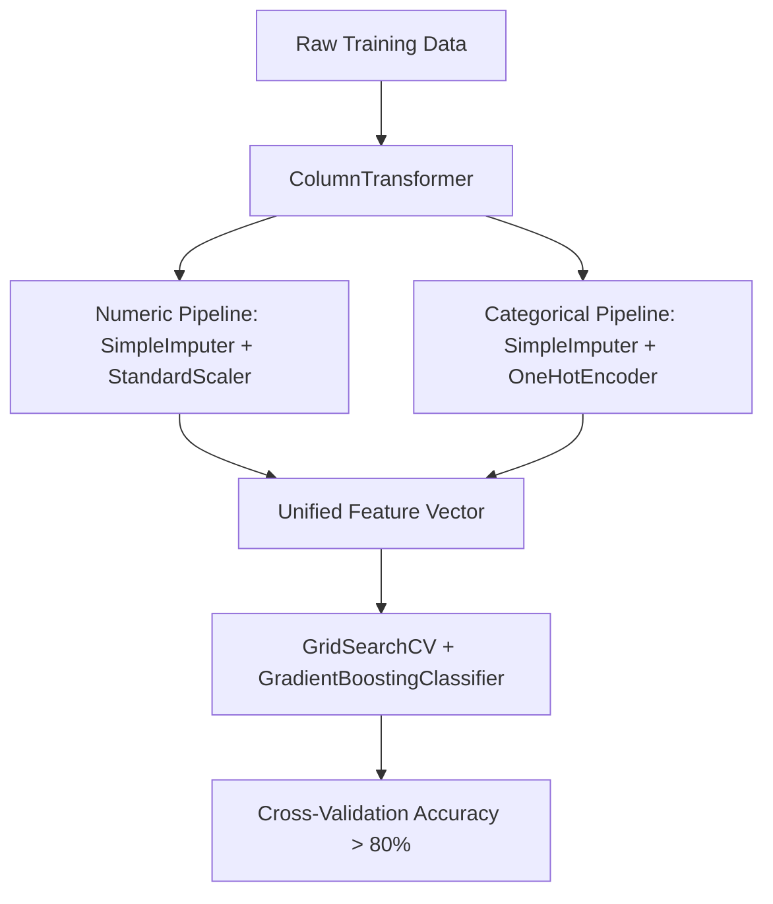

# Leak-Free Machine Learning Pipelines & Hyperparameter Tuning

A best-practices machine learning engineering project demonstrating leak-free data preprocessing, ColumnTransformer architecture, and systematic GridSearchCV hyperparameter optimization in Scikit-Learn.

[](https://www.kaggle.com/code/lazer999/0-80-hyperparameter-tuning-with-pipelines)
[](LICENSE)
[](https://www.python.org/downloads/)
[](#)

---

## Table of Contents
- [Project Overview](#project-overview)
- [Key Highlights & Results](#key-highlights--results)
- [System Architecture & Workflow](#system-architecture--workflow)
- [Repository Structure](#repository-structure)
- [Quickstart & Reproduction](#quickstart--reproduction)
- [Dataset Details](#dataset-details)
- [Author & Acknowledgments](#author--acknowledgments)

---

## Project Overview

This repository provides the complete, production-structured implementation of the **[Leak-Free Machine Learning Pipelines & Hyperparameter Tuning](https://www.kaggle.com/code/lazer999/0-80-hyperparameter-tuning-with-pipelines)** project originally published on Kaggle. 

The primary focus of this work is translating complex data into actionable machine learning solutions using disciplined data engineering, rigorous validation strategies, and clean, leak-free preprocessing pipelines.

---

## Key Highlights & Results

- Demonstrates strictly leak-free preprocessing by bundling transformers and estimators into unified pipelines.
- Separate preprocessing branches for numeric columns (median imputation, standard scaling) and categorical columns (frequent imputation, one-hot encoding).
- Executed exhaustive `GridSearchCV` parameter sweeps over `GradientBoostingClassifier`.
- Achieved 80%+ cross-validated classification accuracy.
- Detailed confusion matrix and classification report evaluations.

---

## System Architecture & Workflow

The pipeline follows a structured, modular execution path:



---

## Repository Structure

```plaintext
hyperparameter-tuning-scikit-pipelines/
├── notebooks/
│   └── hyperparameter-tuning-scikit-pipelines.ipynb      # Original Jupyter notebook with full exploratory visuals
├── src/
│   └── main.py                # Modular, executable Python pipeline
├── .gitignore                 # Standard Python/Jupyter ignores
├── LICENSE                    # MIT License
├── README.md                  # Human-friendly documentation
└── requirements.txt           # Verified Python dependencies
```

---

## Quickstart & Reproduction

### 1. Clone the Repository
```bash
git clone https://github.com/musaoc/hyperparameter-tuning-scikit-pipelines.git
cd hyperparameter-tuning-scikit-pipelines
```

### 2. Set Up a Virtual Environment
```bash
# Linux / macOS
python3 -m venv venv
source venv/bin/activate

# Windows
python -m venv venv
.\venv\Scripts\activate
```

### 3. Install Dependencies
```bash
pip install --upgrade pip
pip install -r requirements.txt
```

### 4. Run the Pipeline
You can run the end-to-end script directly:
```bash
python src/main.py
```

Or open and run the interactive notebook:
```bash
jupyter lab notebooks/hyperparameter-tuning-scikit-pipelines.ipynb
```

---

## Dataset Details

- **Dataset / Competition**: [Spaceship Titanic Competition Dataset](https://www.kaggle.com/c/spaceship-titanic)
- **Origin Platform**: Kaggle
- For automated dataset downloading via Kaggle CLI:
  ```bash
  kaggle competitions download -c spaceship-titanic
  ```

---

## Author & Acknowledgments

- **Author**: **Muhammad Musa Khan** (Kaggle Master)
- **Kaggle Profile**: [@lazer999](https://www.kaggle.com/lazer999)
- **GitHub**: [@musaoc](https://github.com/musaoc)
- **Original Kaggle Solution**: [Leak-Free Machine Learning Pipelines & Hyperparameter Tuning](https://www.kaggle.com/code/lazer999/0-80-hyperparameter-tuning-with-pipelines)

If you found this project helpful or insightful, please consider starring the repository ⭐!
